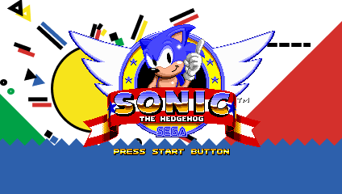
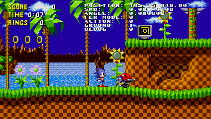

# Open Sonic 1 Recreation
Open source recreation of original Sonic The Hedgehog 1991 game build from ground on C++ programming language.




# Controls
* Gameplay
  * __Arrows__ - movement
  * __Z__ - Jump
  * __X__ - Spindash (CD Style)
* System
  * __C__ - On/Off Noclip
  * __F__ - Change window size
  * __R__ - Restart level
  * __Q__ - Go to previous level
  * __E__ - Go to next level

# Check list
* Player ✔️
  * Basic Movement ✔️
  * 360 Movement ✔️
  * Collisions ✔️
  * Basic Actions ✔️
* Sounds ✔️
* Music ✔️
* Background parallax ✔️
* HUD ✔️
* Spikes ✔️
* Springs ✔️
* Bosses ❌
* Enemies 
  * Moto Bug ✔️
  * Chopper ✔️
  * Crabmeat ✔️
  * Buzz Bomber ✔️
  * Newtron ❌
  * Ball Hog ❌
  * Batbrain ❌
  * Bomb ❌
  * Burrobot ❌
  * Roller ❌
  * Spikes ❌
  * Unidasu ❌
* Levels \<Collisions\> \<Gimmicks\>
  * Green Hill ✔️✔️
  * Marble ✔️❌
  * Spring Yard ✔️❌
  * Labyrinth ✔️❌
  * Starlight ✔️❌
  * Scrap Brain ✔️❌

# Sources used
* [Sonic 1 Disassembly](https://github.com/sonicretro/s1disasm)
* [Sonic Physics Guide](http://info.sonicretro.org/Sonic_Physics_Guide/)
* [Sonic Hacking Guide](http://info.sonicretro.org/SCHG:Sonic_Community_Hacking_Guide/)
* [Spirtes Resource](https://www.spriters-resource.com/)
* [Sound Resource](https://www.sounds-resource.com/)

# Build information
## Common
You need SFML2 library to build it: https://www.sfml-dev.org/download.php
link following libraries: -lsfml-window -lsfml-graphics -lsfml-system -lsfml-audio
Put output file and sfml dlls to bin folder
## Compiling args
```
<your compiller> src\*.cpp -I include\ -I <path to SFML2 include folder> -L <path to SFML2 lib folder> -o bin\sonic.exe -lsfml-window -lsfml-graphics -lsfml-system -lsfml-audio
```
Example for MinGW / GCC
```
g++ src\*.cpp -I include\ -I lib\x64\SFML-2.5.1\include -L lib\x64\SFML-2.5.1\lib -o bin\sonic.exe -lsfml-window -lsfml-graphics -lsfml-system -lsfml-audio
```

